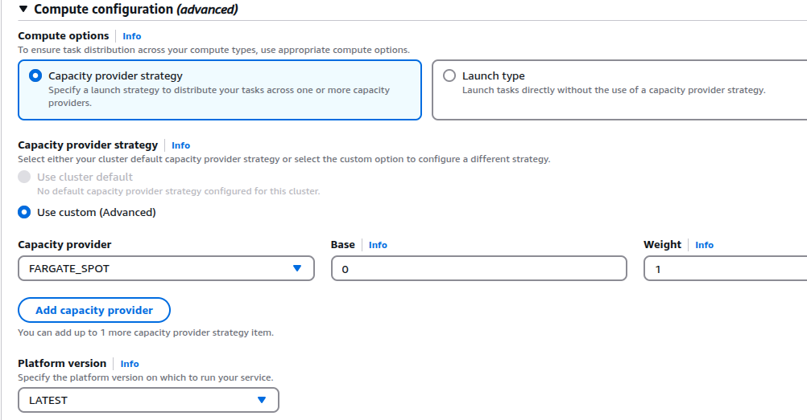
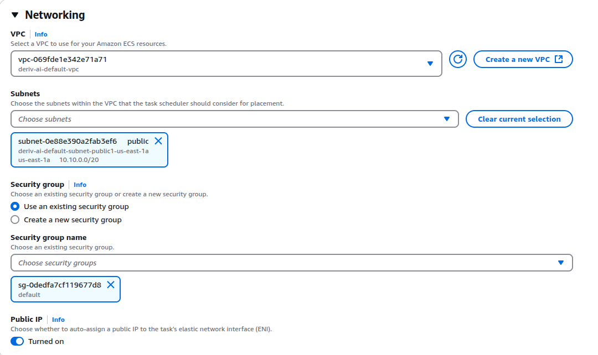

Step 2: Containerize the App Using Docker
Now we need to create a Dockerfile to package the app into a container.

1. Create a Dockerfile
Inside the ecs-python-app directory, create a file named Dockerfile:

dockerfile
Copy code
# Use the official Python image
FROM python:3.9

# Set the working directory inside the container
WORKDIR /app

# Copy application files
COPY requirements.txt .
RUN pip install -r requirements.txt

COPY . .

# Expose port 5000
EXPOSE 5000

# Run the application
CMD ["python", "app.py"]
2. Build the Docker Image
Run the following command:

sh
Copy code
docker build -t flask-ecs-app .
3. Test the Docker Container Locally
Run the container:

sh
Copy code
docker run -p 5000:5000 flask-ecs-app
Visit http://localhost:5000 in a browser to check if it's working.

Step 3: Push the Docker Image to AWS Elastic Container Registry (ECR)
AWS ECR is a private Docker registry where we store the image before deploying it to ECS.

1. Authenticate with AWS
Make sure AWS CLI is installed (aws --version), then authenticate:

sh
Copy code
aws configure
Enter your:

AWS Access Key ID
AWS Secret Access Key
AWS Region (e.g., us-east-1)
2. Create an ECR Repository
Create a repository in AWS ECR:

sh
Copy code
aws ecr create-repository --repository-name elnaz-test/flask-ecs-app
3. Get the Repository URL
Run:

sh
Copy code
aws ecr describe-repositories --query "repositories[*].repositoryUri"
Copy the repository URI, e.g., 123456789012.dkr.ecr.us-east-1.amazonaws.com/flask-ecs-app.

4. Tag and Push Docker Image
Authenticate Docker with AWS ECR:

sh
Copy code
aws ecr get-login-password | docker login --username AWS --password-stdin 123456789012.dkr.ecr.us-east-1.amazonaws.com
or
aws ecr get-login-password --region us-east-1 | docker login --username AWS --password-stdin 058264144981.dkr.ecr.us-east-1.amazonaws.com

Now, tag the image and push it:

docker build -t elnaz-test/flask-ecs-app .
docker images

sh
Copy code
docker tag elnaz-test/flask-ecs-app:latest 058264144981.dkr.ecr.us-east-1.amazonaws.com/elnaz-test/flask-ecs-app:latest

docker push 058264144981.dkr.ecr.us-east-1.amazonaws.com/elnaz-test/flask-ecs-app:latest

Now, our Docker image is stored in ECR 🎉.

Step 4: Create an ECS Cluster
ECS (Elastic Container Service) allows you to run and manage Docker containers in AWS.

1. Create an ECS Cluster
Run:

sh
Copy code
aws ecs create-cluster --cluster-name flask-cluster
2. Create a Task Definition
A task definition specifies how containers run in ECS.

Save this as task-def.json:

json
Copy code
{
  "family": "flask-task",
  "containerDefinitions": [
    {
      "name": "flask-container",
      "image": "058264144981.dkr.ecr.us-east-1.amazonaws.com/elnaz-test/flask-ecs-app:latest",
      "memory": 512,
      "cpu": 256,
      "essential": true,
      "portMappings": [
        {
          "containerPort": 5000,
          "hostPort": 5000
        }
      ]
    }
  ]
}
Register the task definition:

sh
Copy code
aws ecs register-task-definition --cli-input-json file://task-def.json
Step 5: Deploy the Container to ECS
1. Run the Task on ECS
Now, run the task:

sh
Copy code
aws ecs run-task --cluster flask-cluster --task-definition flask-task
This starts a container running in ECS.

*If do manually choose Capacity provider FARGATE_SPOT*

2. Create a Service (For Load Balancing & Scaling)
To keep the app always running, create a service:

sh
Copy code
aws ecs create-service \
    --cluster flask-cluster \
    --service-name flask-service \
    --task-definition flask-task \
    --desired-count 1 \
    --launch-type FARGATE \
    --network-configuration "awsvpcConfiguration={subnets=[subnet-id],securityGroups=[security-group-id],assignPublicIp=ENABLED}"
Replace:

[subnet-id] (Find in AWS VPC)
[security-group-id] (Allow port 5000)
3. Get the Public IP of the Running Container
Find the task’s public IP:

sh
Copy code
aws ecs list-tasks --cluster flask-cluster
Get detailed info:

sh
Copy code
aws ecs describe-tasks --cluster flask-cluster --tasks <TASK_ID>
Look for the public IP and open it in your browser:

sh
Copy code
http://<PUBLIC_IP>:5000

#------------------cloud run ------------------------------
curl -O https://dl.google.com/dl/cloudsdk/channels/rapid/downloads/google-cloud-cli-linux-x86_64.tar.gz

tar -xf google-cloud-cli-linux-x86_64.tar.gz
